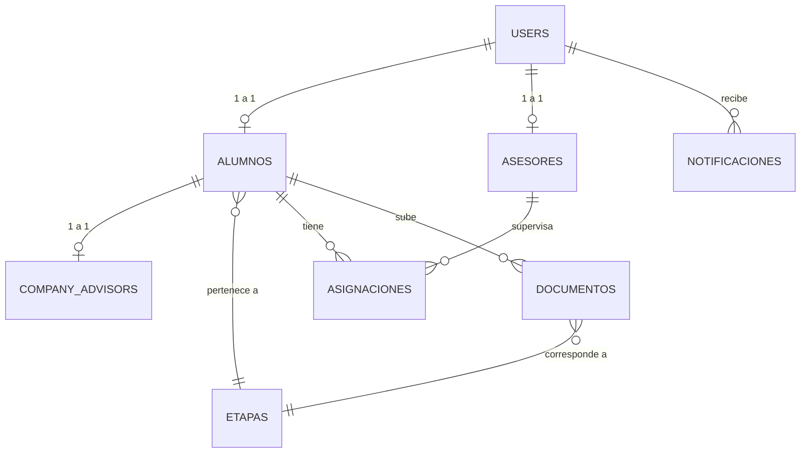

# Documentación de Base de Datos

Este documento detalla la estructura relacional, decisiones de diseño y normalización de la base de datos del Sistema de Residencias Profesionales UTGZ.

## Decisiones de Diseño (Normalización)
- **Centralización de Credenciales:** En lugar de tener tablas separadas de credenciales para Alumnos y Asesores, se utilizó la tabla central `users`. `alumnos` y `asesores` actúan como perfiles extendidos, reduciendo la redundancia y centralizando la autenticación.
- **Catálogo de Etapas:** Se creó una tabla `etapas` independiente. En vez de "hardcodear" el flujo (paso 1, paso 2) en el código, el sistema consulta esta tabla, permitiendo cambiar el orden o nombres de las etapas en el futuro sin reescribir código (Principio OCP de SOLID).
- **Aislamiento de la Empresa:** Los datos de la empresa receptora no residen en la tabla `alumnos`. Se extrajeron a `company_advisors` (Relación 1 a 1) para mantener la tabla de alumnos limpia y permitir escalabilidad futura (ej. darles login a los asesores empresariales).
- **Llaves Foráneas Estrictas:** Toda la base de datos cuenta con `foreign constraints` (Cascade/Set Null) para mantener integridad referencial a nivel motor (MySQL 8).

---

## Diccionario de Tablas

### 1. `users`
**Propósito:** Manejar el acceso al sistema (Login) y roles globales (vía Spatie).
- `id` (PK)
- `name`: Nombre completo del usuario.
- `email`: Correo institucional.
- `password`: Hash bcrypt de la contraseña.
- `created_at` / `updated_at`

### 2. `alumnos`
**Propósito:** Extensión del modelo de usuario con información puramente académica del estudiante.
- `id` (PK)
- `user_id` (FK -> users.id): Relación 1:1.
- `etapa_id` (FK -> etapas.id): Indica en qué etapa del proceso de residencia se encuentra actualmente el alumno.
- `matricula`: Identificador único (ej. 23610062).
- `carrera`: Nombre de la carrera académica.
- `cuatrimestre`: Cuatrimestre en curso.

### 3. `asesores`
**Propósito:** Extensión del modelo de usuario para los docentes encargados de revisar documentos.
- `id` (PK)
- `user_id` (FK -> users.id): Relación 1:1.
- `departamento`: Área académica a la que pertenece (ej. TIC, Mecatrónica).

### 4. `company_advisors` (Asesores Organizacionales)
**Propósito:** Almacenar los datos de la empresa donde el alumno hace su residencia, incluyendo a su jefe directo (asesor organizacional).
- `id` (PK)
- `alumno_id` (FK -> alumnos.id): Relación 1:1.
- `empresa`: Nombre oficial de la entidad receptora.
- `nombre`: Nombre del asesor en la empresa.
- `puesto`: Cargo del asesor en la empresa.
- `telefono`: (Opcional) Contacto de emergencia.

### 5. `asignaciones`
**Propósito:** Tabla de rompimiento (Pivote) entre Alumnos y Asesores.
- `id` (PK)
- `alumno_id` (FK -> alumnos.id)
- `asesor_id` (FK -> asesores.id)
- *Nota:* Actualmente es 1 a 1 por alumno (Un alumno solo tiene un asesor activo).

### 6. `etapas`
**Propósito:** Catálogo oficial del proceso de la UTGZ.
- `id` (PK)
- `codigo`: Identificador institucional (ej. FOR-06-12).
- `nombre`: Título amigable de la etapa.
- `descripcion`: Instrucciones de la etapa.
- `orden` (Integer): Define la secuencia lógica. 1 = Primero, 2 = Segundo, etc.
- `tipo` (String): Clasificación interna (ej. 'documento', 'evaluacion').
- `activo` (Boolean): Bandera para deshabilitar formatos antiguos sin borrar el historial.

### 7. `documentos`
**Propósito:** Tabla transaccional central. Registra cada archivo subido.
- `id` (PK)
- `alumno_id` (FK -> alumnos.id)
- `etapa_id` (FK -> etapas.id): A qué etapa pertenece este archivo.
- `archivo_path`: Ruta física dentro del disco `storage/app/`.
- `estado` (Enum): `pendiente`, `aprobado`, `rechazado`.
- `comentarios`: (Opcional) Texto de retroalimentación en caso de rechazo (Planeado para Sprints futuros).

### 8. `notificaciones`
**Propósito:** Historial de eventos y alertas para los usuarios.
- `id` (PK)
- `user_id` (FK -> users.id): Dueño de la notificación.
- `titulo`: Encabezado del mensaje.
- `mensaje`: Cuerpo detallado.
- `leida` (Boolean): Estado visual.

### Tablas Adicionales (Spatie Laravel-Permission)
- `roles`: Nombres de roles (Coordinador, Asesor, Alumno).
- `permissions`: Permisos detallados.
- `model_has_roles`: Relación de qué usuario tiene qué rol.

---

## Diagrama Entidad-Relación Simplificado

## Ejemplo de Registros

**Alumnos:**
| id | user_id | etapa_id | matricula | carrera | cuatrimestre |
|----|---------|----------|-----------|---------|--------------|
| 1  | 4       | 1        | 23610062  | TSU TIC | Sexto        |

**Etapas:**
| id | codigo | nombre | orden | tipo | activo |
|----|--------|--------|-------|------|--------|
| 1  | FOR-06-12 | Carta de Aceptación | 1 | documento | true |

**Documentos:**
| id | alumno_id | etapa_id | estado | archivo_path |
|----|-----------|----------|--------|--------------|
| 1  | 1         | 1        | aprobado | documentos/23610062_FOR-06-12.pdf |
