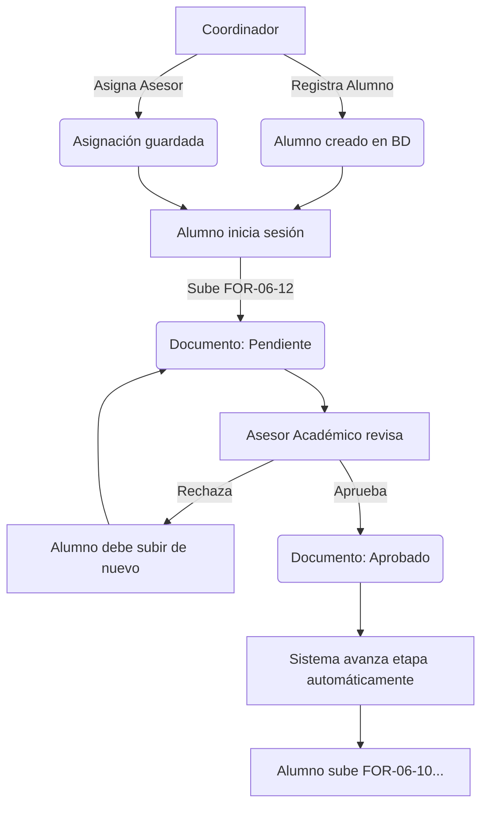

# System Overview: Residencias Profesionales UTGZ

## Introducción

### ¿Qué es Residencias UTGZ?
Es una plataforma web institucional diseñada específicamente para la Universidad Tecnológica de Gutiérrez Zamora (UTGZ). Su propósito central es digitalizar, gestionar y automatizar el proceso de **Residencias Profesionales**, el cual es el último paso académico que realizan los estudiantes antes de graduarse.

### ¿Qué problema resuelve?
Históricamente, el control de las residencias profesionales se ha llevado a cabo mediante procesos manuales, correos electrónicos sueltos, mensajes de WhatsApp y montañas de papeleo físico. Esto generaba:
- **Pérdida de documentos** y descontrol en las versiones.
- **Falta de visibilidad** para el Coordinador sobre el estado real de cada alumno.
- **Cuellos de botella** en la revisión y retroalimentación por parte de los asesores.
- **Tiempos de respuesta lentos** que afectaban la titulación del estudiante.

La plataforma resuelve esto centralizando la comunicación, forzando un flujo de trabajo estructurado y proveyendo métricas en tiempo real.

### ¿Por qué fue desarrollado?
Fue desarrollado para modernizar la infraestructura de software de la UTGZ, garantizando una herramienta a la medida que respete estrictamente los formatos oficiales (FOR-06-12, FOR-06-10) y aplique reglas de negocio inquebrantables, reduciendo la carga administrativa y mejorando la experiencia de usuario (UX) tanto para estudiantes como para docentes.

### Objetivos
- **General:** Automatizar el 100% del seguimiento documental de las residencias profesionales en la UTGZ mediante un sistema web escalable y seguro.
- **Específicos:**
  - Reducir el tiempo de revisión de formatos en un 50%.
  - Eliminar el uso de papel en las etapas iniciales del proceso.
  - Proveer un dashboard analítico al Coordinador para la toma de decisiones.
  - Establecer una arquitectura de software limpia que sirva como base para futuros módulos universitarios.

---

## Flujo Completo del Sistema

El proceso está estrictamente secuenciado. Un alumno no puede subir un formato de la Etapa 2 si la Etapa 1 no ha sido aprobada.

### Paso a paso:
1. **Registro:** El Coordinador crea la cuenta del Alumno y del Asesor.
2. **Asignación:** El Coordinador vincula al Alumno con su Asesor Académico.
3. **Inicio de Sesión:** El Alumno ingresa al portal. Su dashboard le indica que está en la etapa inicial (`FOR-06-12`).
4. **Captura y Subida:** El Alumno llena los datos de su Empresa, Asesor Organizacional y sube su archivo PDF.
5. **Notificación:** (Pendiente de implementación) El Asesor recibe un correo indicando que tiene un documento por revisar.
6. **Revisión:** El Asesor entra a su dashboard, abre el documento y decide.
7. **Resolución:**
   - Si **Aprueba**: Un `Event` de Laravel se dispara, un `Listener` verifica si es el último documento de la etapa, y si es así, avanza al alumno a la siguiente.
   - Si **Rechaza**: (Pendiente de implementación) Escribe un comentario de retroalimentación. El documento se marca como rechazado y el alumno debe corregirlo.

---

## Roles

El sistema está blindado por permisos utilizando `spatie/laravel-permission`.

### 1. Alumno
- **Qué puede hacer:** Ver su estado actual, subir documentos correspondientes a su etapa activa, actualizar su información de perfil.
- **Qué no puede hacer:** Saltar etapas, ver documentos de otros alumnos, eliminar un documento que ya fue revisado.
- **Pantallas que utiliza:** Dashboard Alumno, Mi Perfil.
- **Ejemplo real:** Josué (Alumno) entra, ve que su Asesor es el Ing. Carlos, y sube su Carta de Aceptación.

### 2. Asesor Académico
- **Qué puede hacer:** Ver la lista de alumnos que le fueron asignados, ver los documentos pendientes de revisión, descargar el PDF, aprobar o rechazar documentos.
- **Qué no puede hacer:** Ver alumnos asignados a otros asesores (protegido vía Policies), crear nuevos alumnos, saltar la validación.
- **Pantallas que utiliza:** Dashboard Asesor, Listado de Alumnos Asignados, Visor de Documento.
- **Ejemplo real:** El Ing. Carlos entra y ve 3 documentos pendientes. Descarga el de Josué, nota que falta una firma y hace clic en "Rechazar".

### 3. Coordinador
- **Qué puede hacer:** Gestión total (CRUD) de Alumnos y Asesores. Asignación de cargas de trabajo. Ver estadísticas globales.
- **Qué no puede hacer:** Subir documentos en nombre del alumno (a menos que se implemente una función de suplantación en el futuro).
- **Pantallas que utiliza:** Dashboard Coordinador (Analíticas), Gestión de Usuarios, Reportes.
- **Ejemplo real:** La coordinadora revisa la gráfica de Chart.js y nota que hay 25 documentos "Rechazados", lo que le indica que los alumnos están teniendo problemas con un formato específico.

---

## Arquitectura

El proyecto no utiliza el MVC tradicional de Laravel donde el Controlador hace todo. Utilizamos una **Arquitectura Limpia (Clean Architecture)** adaptada.

### MVC (Model-View-Controller)
- **¿Qué es?** Patrón de diseño de software.
- **¿Por qué lo usamos?** Viene por defecto en Laravel y separa la presentación de la lógica.
- **¿Cómo se usa?** Los Controladores reciben la petición de la Vista (Blade), pero en lugar de ir a la Base de Datos (Modelo), llaman al Servicio o Repositorio.

### Repository Pattern
- **¿Qué es?** Capa de abstracción entre la lógica y la base de datos.
- **¿Por qué lo usamos?** Para no tener consultas Eloquent gigantes (`where('x')->orderBy('y')->get()`) dentro del controlador.
- **¿Cómo se usa?** `DocumentoRepository->getPendientesPorAsesor($asesorId)`. Si mañana cambiamos MySQL por MongoDB, el controlador no se entera, solo modificamos el repositorio.
- **¿Qué pasaría si no existiera?** Controladores engordados (Fat Controllers), código repetido y difícil de testear.

### Service Layer
- **¿Qué es?** Clases que manejan la lógica de negocio pesada.
- **¿Por qué lo usamos?** Subir un archivo implica validar, guardar en disco, renombrar y crear un registro en BD. Eso no pertenece al Controlador.
- **¿Cómo se usa?** `DocumentoService->subirDocumento($file, $alumno_id)`.

### Events y Listeners
- **¿Qué es?** Sistema de publicación-suscripción (Pub/Sub).
- **¿Por qué lo usamos?** Para desacoplar acciones colaterales.
- **¿Cómo se usa?** Cuando el Asesor aprueba un documento, el controlador no calcula si el alumno debe subir de etapa. El controlador solo dispara el evento `DocumentoRevisado`. El listener `AvanzarEtapaAlumno` escucha esto en segundo plano y hace el cálculo.
- **¿Qué pasaría si no existiera?** Código "espagueti". El controlador del documento tendría dependencias de Etapas, Notificaciones, Emails, etc.

### Policies
- **¿Qué es?** Clases de Laravel que dictan si un usuario puede hacer una acción sobre un modelo específico.
- **¿Por qué lo usamos?** Para seguridad a nivel de fila (Row-level security).
- **¿Cómo se usa?** `DocumentoPolicy` verifica que el Asesor X solo pueda aprobar el Documento Y si el Documento Y pertenece a un Alumno asignado al Asesor X.

### Enums
- **¿Qué es?** Enumeraciones fuertemente tipadas de PHP 8.1.
- **¿Por qué lo usamos?** Evita los "Magic Strings". En lugar de guardar estado `'aprobado'`, usamos `DocumentoEstado::Aprobado`.
- **¿Cómo se usa?** Se usa en validaciones, migraciones y comparaciones. Si nos equivocamos al escribir, PHP lanza error antes de ejecutar.

### Otras Herramientas Core
- **Spatie Laravel-Permission:** Gestión de Roles (Coordinador, Asesor, Alumno) sin reinventar la rueda. Permite escalabilidad (ej. rol "Director").
- **Laravel Breeze:** Scaffolding de autenticación seguro, probado e integrado con Tailwind.
- **Sanctum:** (Pendiente) Para emitir Tokens si en el futuro se crea la App Móvil.
- **Storage:** API de Laravel para guardar archivos. Evita guardar los PDFs en carpetas públicas inseguras.
- **Mail:** (Pendiente) Conector para enviar notificaciones SMTP.
- **Tailwind CSS & Alpine.js:** Frameworks Frontend. Tailwind permite estilado rápido sin salir del HTML. Alpine provee interactividad ligera (modales, dropdowns, disables) sin la carga de React o Vue.
- **Chart.js:** Librería de JavaScript para renderizar la gráfica de dona en el dashboard del coordinador.

---

## Base de Datos

Explicación detallada en [DATABASE.md](./DATABASE.md). Resumen rápido:
El sistema es relacional. `User` es el centro de autenticación. `Alumno` y `Asesor` son perfiles extendidos de `User`. `Asignacion` es la tabla pivote que los une. `Etapa` funciona como un catálogo estático oficial. `Documento` es el núcleo transaccional. `CompanyAdvisor` extiende la información del alumno hacia el exterior de forma limpia.

---

## Flujo de Documentos

1. **FOR-06-12 (Carta de Aceptación):** Es la Etapa 1. Al subirla, el alumno también captura `CompanyAdvisor`. El Asesor evalúa que la empresa sea válida.
2. **(Pendiente en Backlog) FOR-06-10 (Reporte Mensual):** El alumno deberá subir varios de estos formatos durante 4 meses.
3. **(Pendiente en Backlog) Evaluación Final:** El Asesor sube calificaciones.

**Avance automático:** El sistema (`AvanzarEtapaAlumno` Listener) compara los documentos requeridos de la etapa actual contra los documentos *aprobados* del alumno. Si la matemática cuadra (1 requerido = 1 aprobado), actualiza `etapa_id` del alumno a `etapa_id + 1`. Todo esto ocurre sin intervención humana.

---

## Seguridad

- **Roles & Policies:** Un Alumno que intente entrar a `/asesor/dashboard` será bloqueado (Middleware de Spatie). Si un Asesor intenta acceder a un documento `ID=5` modificando la URL, la Policy verificará que ese documento sea de uno de sus alumnos asignados; si no lo es, devuelve un `403 Forbidden`.
- **CSRF:** Todos los formularios Blade usan `@csrf` para prevenir ataques de falsificación de peticiones entre sitios.
- **Hash de Contraseñas:** Bcrypt nativo de Laravel.
- **Form Requests:** Toda entrada de usuario (archivos, textos) es sanitizada antes de llegar al controlador mediante validaciones estrictas (`StoreDocumentoRequest`).
- **Storage Privado:** Los PDFs subidos por los alumnos se guardan en `storage/app/documentos`, una ruta inaccesible públicamente desde la URL del navegador. Solo a través de una ruta protegida con Middleware un usuario autenticado puede descargarlo.

---

## Tecnologías

Para una tabla detallada de tecnologías y justificaciones, ver [TECH_STACK.md](./TECH_STACK.md).

---

## Preguntas Frecuentes (Defensa del Proyecto)

**¿Por qué Laravel y no Node.js/Python?**
Laravel es el estándar de oro en PHP para desarrollo web rápido, seguro y empresarial. Para un sistema institucional que maneja usuarios, roles, subida de archivos y bases de datos relacionales, Laravel ofrece soluciones robustas *out-of-the-box* (Breeze, Eloquent, Storage) que en Node.js tendríamos que programar a mano o uniendo decenas de librerías de terceros, asumiendo riesgos de seguridad.

**¿Por qué Repository y Service Layer si Laravel ya tiene Eloquent?**
Eloquent es fantástico, pero usarlo directamente en los Controladores crea deuda técnica. Si en el controlador `AlumnoController` ponemos la lógica de cómo se sube un PDF a AWS S3 y cómo se guarda en la base de datos, ese código no es reutilizable. Al usar `DocumentoService`, si mañana queremos subir un documento vía API Móvil, o por consola (`artisan tinker`), reutilizamos el mismo servicio exacto.

**¿Por qué el Asesor Organizacional (Empresa) no tiene login?**
Para reducir la fricción. La mayoría de los asesores en las empresas no quieren crear cuentas en sistemas de universidades de sus practicantes; lo ven como burocracia. Al tener a la empresa como un dato administrado (Modelo `CompanyAdvisor` atado al Alumno), simplificamos la adopción del sistema sin perder la rastreabilidad de quién supervisa al alumno externamente.

**¿Por qué usar Events y no llamar a una función `avanzarEtapa()` en el controlador?**
Principio Abierto/Cerrado (SOLID). Si mañana nos piden que además de avanzar de etapa, se envíe un correo al alumno, un SMS al coordinador, y se imprima un PDF, el controlador del Asesor tendría 100 líneas de código extra. Con eventos, el controlador sigue diciendo solo `event(new DocumentoRevisado())`. Nosotros simplemente agregamos más *Listeners* (Escuchadores) sin tocar el controlador.

---

## Caso de Uso Completo: La Travesía de Josué

1. Inicia el cuatrimestre. El Coordinador ingresa al sistema y da de alta a **Josué Pérez**.
2. El Coordinador asocia a Josué con la **Ing. María** (Asesor Académico).
3. Josué ingresa con su matrícula y contraseña generada. Ve su dashboard limpio, indicando que está en la etapa **FOR-06-12**.
4. Josué consiguió residencia en *TechCorp*. Llena el formulario indicando que su Asesor Organizacional es *Carlos Slim*. Sube su PDF escaneado y hace clic en Enviar.
5. El documento cambia a "En Revisión". Josué ya no puede volver a subir documentos ni borrar el que subió.
6. La Ing. María entra a su panel. Ve la notificación de Josué.
7. Abre el documento. Observa que el sello es incorrecto. Presiona "Rechazar" y anota: *"El sello no corresponde a la empresa registrada"*.
8. Josué entra, ve la alerta en rojo, lee el comentario, y sube un PDF corregido.
9. La Ing. María lo revisa de nuevo y esta vez presiona "Aprobar".
10. ¡Magia! El sistema detecta el evento. Verifica que la etapa 1 requiere 1 documento. Como se cumplió, avanza a Josué a la etapa FOR-06-10.
11. Cuando Josué actualice la página, su dashboard habrá cambiado mágicamente indicándole los nuevos requisitos, sin que el Coordinador haya tenido que mover un solo papel.

---

## Conclusiones
La arquitectura elegida (Clean Architecture sobre Laravel) garantiza que el sistema no colapse cuando la UTGZ necesite escalarlo a 5,000 alumnos simultáneos. La separación de responsabilidades asegura que si un componente falla (por ejemplo, el envío de correos SMTP), la subida de documentos siga funcionando intacta. Este proyecto no es una tarea escolar, es software de grado empresarial.
